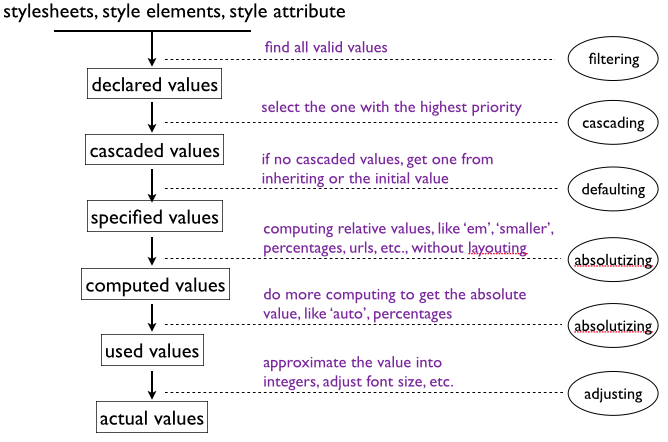

# CSS Cascading

## Processing Values

>One of the fundamental design principles of CSS is cascading, which allows several style sheets to influence the presentation of a document. When different declarations try to set a value for the same element/property combination, the conflicts must somehow be resolved.

>The opposite problem arises when no declarations try to set a the value for an element/property combination. In this case, a value is be found by way of inheritance or by looking at the property’s initial value.

>The **cascading** and **defaulting** process takes a set of declarations as input, and outputs a specified value for each property on each element.



## Cascading

>The cascade takes an unordered list of declared values for a given property on a given element, sorts them by their declaration’s precedence as determined below, and outputs a single cascaded value.

* Origin and Importance
* Specificity
* Order of Appearance

### Origin and Importance

See [here](https://drafts.csswg.org/css-cascade/#cascade-origin)

### Specificity

* count the number of ID selectors in the selector (= A)
* count the number of class selectors, attributes selectors, and pseudo-classes in the selector (= B)
* count the number of type selectors and pseudo-elements in the selector (= C)
* ignore the universal selector

```css
*               /* a=0 b=0 c=0 */
LI              /* a=0 b=0 c=1 */
UL LI           /* a=0 b=0 c=2 */
UL OL+LI        /* a=0 b=0 c=3 */
H1 + *[REL=up]  /* a=0 b=1 c=1 */
UL OL LI.red    /* a=0 b=1 c=3 */
LI.red.level    /* a=0 b=2 c=1 */
#x34y           /* a=1 b=0 c=0 */
```

### Example

* <https://jsbin.com/nusatu/edit?html,css,output>

### Order of Appearance

>The last declaration in document order wins.

* Declarations from imported style sheets are ordered as if their style sheets were substituted in place of the @import rule.
* Declarations from style sheets independently linked by the originating document are treated as if they were concatenated in linking order, as determined by the host document language.
* Declarations from style attributes are ordered according to the document order of the element the style attribute appears on, and are all placed after any style sheets.

#### the `@import` rule

>If an @import rule refers to a valid stylesheet, user agents must treat the contents of the stylesheet as if they were written in place of the @import rule.

>Any @import rules must precede all other at-rules and style rules in a style sheet (besides @charset, which must be the first thing in the style sheet if it exists), or else the @import rule is invalid. 

### the `!important` annotation

## Defaulting

### Initial Values

>Each property has an initial value, defined in the property’s definition table. If the property is not an inherited property, and the cascade does not result in a value, then the specified value of the property is its initial value.

[width](https://drafts.csswg.org/css-box-3/#the-width-and-height-properties)


### Inheritance

>Inheritance propagates property values from parent elements to their children.

>The inherited value of a property on an element is the **computed value** of the property on the element’s parent element.

[line-height](http://www.w3.org/TR/CSS2/visudet.html#propdef-line-height)


## More info

* <http://www.w3.org/TR/css-cascade-4/>
* <https://drafts.csswg.org/css-cascade/>
* <https://drafts.csswg.org/css-cascade-3/>
