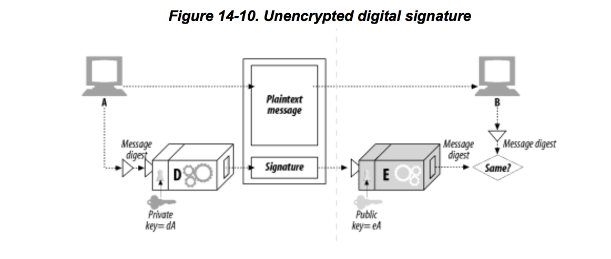
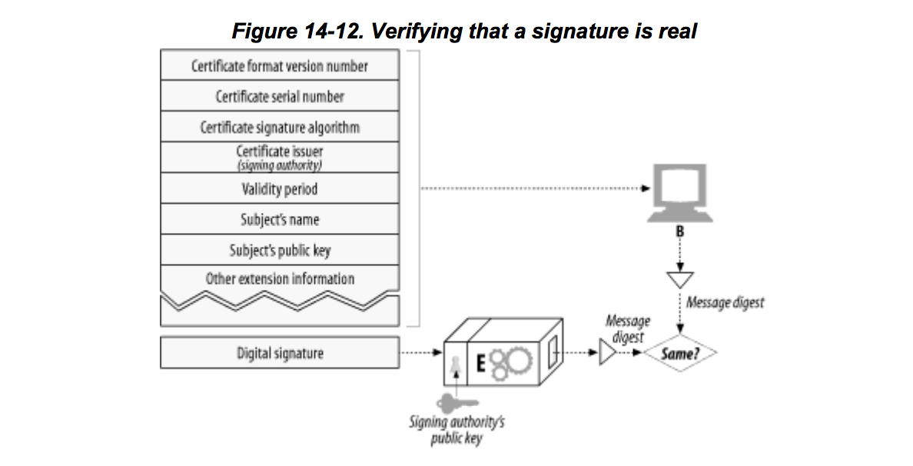

# HTTPS

## 安全问题
>Confidentiality

保密性。
防止信息的暴露。

>Integrity

完整性。防止信息被篡改。

>Originality

原创性。
第三方可能截获请求信息，之后再去向服务器发请求。
譬如一个下订单的请求，第三方截获后，并不去解密，或是修改，而是将它向服务器反复发送，以达到攻击的目的。
此种攻击行为称为`replay attack`。

>Timeliness

时效性。
与`replay attack`不同，第三方截获后，并不反复发送，而只是延迟请求时间。
譬如一个买入股票的请求，延迟后可能就在一个意想不到的价位入手了。

>Authentication

身份认证。
有些攻击者可能修改DNS解析，将URL解析到他们想要的IP地址。


## 数字加密
通过加密算法来解决保密性的问题。

其基本原理是，发送方通过加密函数，将一段明文（plaintext）转换成密文（ciphertext），
接收方在收到密文后，使用解密函数将密文再转换成明文。
对于不知道解密函数的第三方而言，密文是没有任何意义的。
因此，称这对加密、解密函数为密码（cipher）。
这里将cipher翻译成加密算法（总觉直译为“密码”怪怪的）。

### 密钥
加密和解密函数通常还需要接收一个密钥（key）做为参数才能正确工作。

传说凯撒曾使用过一种“三字符旋转”（three-character rotation）加密方式，
将消息中的每个字母都用字母表中比它排列靠后三个位置的字母替代。


这里，加密和解密使用的密钥是3.

由于好的加密算法很有限，不可能大家都使用不同的加密算法。
且一旦暴露，再找替代品也很麻烦。
所以，一般加密算法本身是公开的，只有密钥才是秘密，需要妥善保管。

当然，攻击者可能通过某些手段事先获得了一些信息。
譬如明文的模式，某些明文对应的密文等等。
优秀的加密算法，即使在同时知道明文和密文的条件下，也无法推断出密钥。

这样，攻击者就只剩下穷举法，去遍历密钥的所有可能值。
如果密钥长度是`n`位，就有`2^n`种可能，平均需要猜`2^n/2`次才能猜中。

假设密钥的长度为128位，则一共有约
262,000,000,000,000,000,000,000,000,000,000,000,000
种可能。

对于目前的计算机而言，在合理的时间内是无法完成破解的。


当然，密钥越长，加密和解密耗时就越多。
所以密钥长度和加密性能间存在一个trade-off。

### 对称加密与非对称加密
如果加密函数与解密函数使用使用同样的密钥，则称为对称加密，否则称为非对称加密。

对称加密时，发送方用加密函数和密钥加密，接收方用解密函数和同一个密钥解密。

在非对称加密中，双方均产生了一对密钥：公钥和私钥。
公钥会公布出去，私钥则当作秘密保管。
发送方在发送消息时，用接收方的公钥进行加密，接收方在收到密文后，便可用自己的私钥进行解密。

对称加密算法有[DES]系列。非对称算法有[RSA]等。

理论上可以通过大数因式分解来破解[RSA]，其复杂度比穷举要快。
因此，一般来说非对称加密要求的密钥长度更大（至少1024位）。
密钥长度大，加密解密速度相对对称加密而言就慢一些。

对称加密中，N个人之间通信，需要两两均确定一个密钥，密钥数量为`N*(N-1)/2`，每个节点需要保管`N-1`个密钥。
在非对称加密中，N个人一共只产生了`2N`个密钥，且每个节点只需要保管一个私钥。

实际应用中，出于性能考虑，主要的数据加密是通过对称加密进行的。
非对称加密一般用来进行认证和创建会话密钥。

### RSA
在现实情况中，第三方可能拿到以下信息：

* 公钥
* 一段密文
* 一段消息及对应的密文

公钥非对称加密算法需要保证即使全部拿到以上信息，
以及知道是用哪种加密算法（甚至实现），都无法破解私钥和密文对应的明文。

[RSA]是一种非常流行的公钥加密算法，它可以做到如上要求。
其依赖的基本原理是，可以找到三个大整数`e`, `d`, `n`，对于任意的整数`m`，下面的等式都成立：


上式左边的运算称为[模幂]，它有`log(ed)`级别的解法。
在这里它最有用的特点就是，即使知道了`e`, `n`, `m`，也很难计算出`d`。

[RSA]还有个特点，上面加密公式中`e`和`d`是可以交换的，即上面的等式可以推出下面的等式：


也就是说，发送方可以用自己的私钥对信息进行加密，接收方用发送方的公钥便能解密。
这个特性对于加密而言没有什么意义，因为大家都能拿到发送方的公钥，也就是说谁都能解密。
但这个特性恰好可以用来做认证，因为只有发送方才可以进行这样的加密，任何接收方都可以用发送方的公钥来验证收到的消息确实来自所认为的发送方。

Bob发送消息给Alice的过程如下：
* Alice将`(n, e)`作为公钥告诉Bob，`(n, d)`作为私钥自己保管。
* Bob想将消息`M`发送给Alice。先将`M`拆解成多个`m`，且`0 ≤ m < n`，`gcd(m, n) = 1`，即`m`小于`n`且与`n`互质。
  拆解需要用到某种[padding]算法。
* Bob利用Alice的公钥`(n, e)`对`m`进行加密。


* 利用前面提到的`e`和`d`可以互换的特性，Alice可以用如下方式从`c`解出`m`，再得到`M`。


注意，在不知道`d`的情况下，知道`c`，`n`和`e`，是无法算出`m`的。
这里唯一知道的就是`0 ≤ m < n`，而`n`的长度就是所谓的密钥的长度。
给定1024位的话，`m`的可能性空间非常大，穷举就不现实了。

#### 公钥与私钥的生成
如上所述，公钥为`(n, e)`，私钥为`(n, d)`。
在`n`足够大的情况下，要想秘密（`m`）不被破解，就需要保证上面提到的两点：
* 可以找到满足条件的`e`, `d`, `n`
* 从`e`, `n`, `m`无法计算出`d`

事实上，`e`, `d`, `n`的生成过程是这样的：
* 随机选两个足够大的质数`p`和`q`。
* `n = pq`。`n`的长度被称为密钥的长度。
* 计算`n`的欧拉函数值。这个值的含义是，小于等于`n`且与`n`互质的正整数个数。
```
φ(n) = φ(p)φ(q) = (p − 1)(q − 1) = n - (p + q -1)

```
* 选取`e`，使得`1 < e < φ(n)`，且`gcd(e, φ(n)) = 1`，即`e`与`φ(n)`互质。
  通常选`e = 65537`。`e`就是公钥指数。
* 从`d⋅e ≡ 1 (mod φ(n))`中计算出`d`，作为私钥指数。

先考虑上面提到的第二点要求：从`e`, `n`, `m`无法计算出`d`。
从最后计算`d`的表达式可以知道，要得到`d`，必须知道`φ(n)`，但其值是保密的，只能推断。
由`φ(n) = (p − 1)(q − 1)`可知，从`n = pq`推断出`φ(n)`，则必须对`n`进行因式分解。
正是因为这个因式分解的难度很大，才使得[RSA]难以破解。
当`n`很大时（如1024位），可以认为无解。目前已知能破解的最大长度为768位。

关于第一点要求的证明，可见[维基百科#RSA]。

## 认证
认证，即能验证某则消息确实来源于某个发送方。

加密本身并不能确保数据的完整性，第三方还是可以篡改消息内容，接收方解密出来后无法判断内容是否被修改过。
当消息可能被篡改时，说消息来源于某个发送方没有什么意义。
所以，确定消息来源于某个发送方，也就意味着需要验证数据的完整性。

认证器（authenticator）可以用来同时确定某则消息来源于某个发送方，且未被修改。

可以结合加密算法和加密哈希函数来生成认证器。

加密哈希函数（cryptographic hash function），可将任意长度的消息映射成一段固定长度的消息摘要（message digest）。
与校验和类似，将消息摘要置于消息体后，便可用来检验消息是否有被意外修改。
但由于加密哈希函数并不是什么秘密，所以第三方截获消息后，可以修改完内容，再生成一份摘要，接收方无法辨别。
所以，单独用加密哈希函数是无法对付恶意篡改者的。
这个时候就需要使用加密算法了。
发送方在生成摘要后，可使用密钥再对摘要进行加密，然后附于消息体后发送走。

如果使用对称加密，则密钥只有发送方和接收方知道。
如果使用非对称加密，则使用的是发送方的私钥，其它方无法对摘要生成同样的加密效果，只能使用发送方的公钥解密出摘要。
所以，接收方将摘要解密出来后，再使用同样的加密哈希函数从消息体计算出一个摘要，
如果这两个摘要相等，便可以确定消息确实来源于预期的发送方，且未被篡改。

由于加密哈希函数将任意长度的消息映射成固定长度的摘要，
本质是将一个无穷空间映射到一个有限空间，
所以存在将不同消息映射成同样的摘要的可能。
因此，第三方可以截获消息后，利用哈希加密函数得到摘要，
再去寻找一则与原消息拥有同样摘要的消息，将新消息发给接收方，
接收方将无法察觉到这样的变动。
故而为了安全起见，要求使用的加密哈希函数有单向性，
即可以方便算出摘要，但从摘要找到可生成它的消息则不太现实。

比较常见的加密哈希函数有[MD5]，[SHA-1]等。

## 数字签名
[数字签名]的目的便是验证当前收到的消息是否来自某某，是否有被篡改。
它使用非对称加密来实现。

下面看一个使用[RSA]来进行[数字签名]的例子。
* A先将消息映射成固定长度的摘要（digest）。譬如使用[MD5]就可以将任意长度的消息映射成128位。
* 使用[RSA]的解密函数`D`将摘要（`c`）映射成签名（`m`）。
  从前面可知`D`是利用私钥做的[模幂]运算，在不知道`d`的情况下，是无法得出`m`的。
  所以，只有A能生成这个签名。
* A将计算好的签名连接到信息后，一起发送给B。
* 如果B想验证收到的消息是否来自A，且是否有被篡改，
  可以使用A的公钥对签名进行加密，得到摘要，与从消息体计算出来的摘要进行对比。




## 数字证书
有了[数字签名]机制，[数字证书]便很容易实现了。

身份证之所以能证明你的身份，是因为大家相信身份证的颁发机构，以及相信身份证难以造假。

[数字证书]证明的是公钥的正确归属，需要权威机构做担保。
证书分为两部分内容，一部分是信息描述，其中包含公钥。
第二部分是权威机构的签名，即用它的私钥针对第一部分内容生成的一个[数字签名]。


网站需要向[CA]申请对应域名的数字证书，[CA]会留下自己的[数字签名]。
浏览器在与网站通信时，先下载它的证书，检查是哪个[CA]签发的，再找出对应[CA]的公钥，如同[数字签名]中描述的那样进行验证。



## HTTPS协议

## 相关
* [HTTP: The Definitive Guide](http://www.staroceans.org/e-book/O'Reilly%20-%20HTTP%20-%20The%20Definitive%20Guide.pdf)
* [Computer Networks: A Systems Approach](http://www.pdfiles.com/pdf/files/English/Networking/Computer_Networks_A_Systems_Approach.pdf)
* [Crash course on cryptography](http://www.iusmentis.com/technology/encryption/crashcourse/)
* [阮一峰：RSA算法原理（一）](http://www.ruanyifeng.com/blog/2013/06/rsa_algorithm_part_one.html)
* [阮一峰：RSA算法原理（二）](http://www.ruanyifeng.com/blog/2013/07/rsa_algorithm_part_two.html)


[RSA]: https://en.wikipedia.org/wiki/RSA_(cryptosystem)
[模幂]: https://en.wikipedia.org/wiki/Modular_exponentiation
[padding]: https://en.wikipedia.org/wiki/Padding_(cryptography)
[MD5]: https://en.wikipedia.org/wiki/MD5
[SHA-1]: https://en.wikipedia.org/wiki/SHA-1
[数字签名]: https://en.wikipedia.org/wiki/Digital_signature
[数字证书]: https://en.wikipedia.org/wiki/Public_key_certificate
[欧拉函数]: https://en.wikipedia.org/wiki/Euler%27s_totient_function
[维基百科#RSA]: https://en.wikipedia.org/wiki/RSA_(cryptosystem)#Proofs_of_correctness
[CA]: https://en.wikipedia.org/wiki/Certificate_authority
[DES]: https://en.wikipedia.org/wiki/Data_Encryption_Standard

